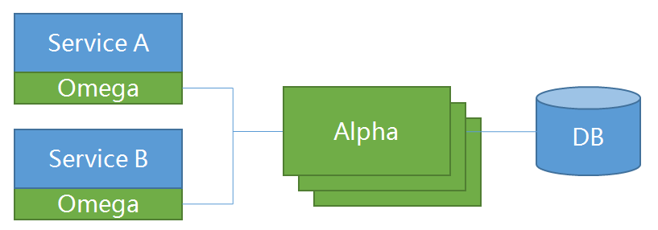

# Saga | [中文](README_ZH.md) [](https://travis-ci.org/apache/incubator-servicecomb-saga?branch=master) [](https://coveralls.io/github/apache/incubator-servicecomb-saga?branch=master)[](http://search.maven.org/#search%7Cga%7C1%7Corg.apache.servicecomb.saga) [](https://www.apache.org/licenses/LICENSE-2.0.html) [](https://gitter.im/ServiceCombUsers/Saga)
Apache ServiceComb (incubating) Saga is an eventually data consistency solution for micro-service applications. Transactions are commited directly in the try phase and compensated in reverse order in the rollback phase comparing to [TCC](http://design.inf.usi.ch/sites/default/files/biblio/rest-tcc.pdf). 

## Features
* High availability. The coordinator is stateless and thus can have multiple instances.
* High reliability. All transaction events are stored in database permanently.
* High performance. Transaction events are reported to coordinator via gRPC and transaction payloads are serialized/deserialized by Kyro.
* Low invasion. All you need to do is add 2-3 annotations and the corresponding compensate methods.
* Easy to deploy. All components can boot via docker.
* Support both forward(retry) and backward(compensate) recovery.

## Architecture
Saga is composed of  **alpha** and **omega**.
* The alpha plays as the coordinator. It is responsible for the management of transactions.
* The omega plays as an agent inside the micro-service. It intercepts incoming/outgoing requests and reports transaction events to alpha.

The following diagram shows the relationships among alpha, omega and services.


See [Saga Pack Design](docs/design.md) for details.

* Go lang version of Omega here https://github.com/jeremyxu2010/matrix-saga-go
* C# version of Omega here https://github.com/OpenSagas-csharp/servicecomb-saga-csharp

## Get Started
* For ServiceComb Java Chassis application, please see [Booking Demo](saga-demo/saga-servicecomb-demo/README.md) for details.
* For Spring applications, please see [Booking Demo](saga-demo/saga-spring-demo/README.md) for details.
* For Dubbo applications, please see [Dubbo Demo](saga-demo/saga-dubbo-demo/README.md) for details.

## Build and Run the tests from source
* Build the source code and run the tests
   ```bash
      $ mvn clean install
   ```
* Build the source demo docker images and run the accept tests
   ```bash
      $ mvn clean install -Pdemo,docker
   ```   
* Current Saga code supports Spring Boot 1.x and Spring Boot 2.x at the same time, saga uses Spring Boot 1.x by default, you can use *-Pspring-boot-2* to switch Spring Boot version to 2.x.
Since Spring Boot supports JDK9 since 2.x, if you want to build and run test the Saga with JDK9 or JDK10, you need to use the spring-boot-2 profile. 
   ```bash
      $ mvn clean install -Pdemo,docker,spring-boot-2
   ```   

## User Guide
How to build and use can refer to [User Guide](docs/user_guide.md).

## Get The Latest Release

[Download Saga](http://servicecomb.incubator.apache.org/release/saga-downloads/)

## [FAQ](FAQ.md)

## Contact Us
* [issues](https://issues.apache.org/jira/browse/SCB)
* [gitter](https://gitter.im/ServiceCombUsers/Saga)
* mailing list: [subscribe](mailto:dev-subscribe@servicecomb.incubator.apache.org) [view](https://lists.apache.org/list.html?dev@servicecomb.apache.org)

## Contributing
See [Pull Request Guide](http://servicecomb.incubator.apache.org/developers/submit-codes/) for details.

## License
Licensed under an [Apache 2.0 license](https://github.com/apache/incubator-servicecomb-saga/blob/master/LICENSE).
