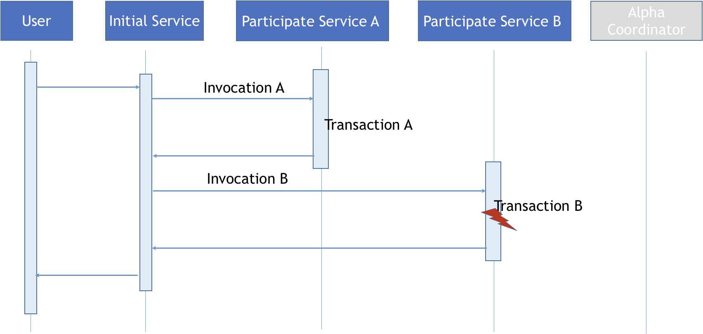
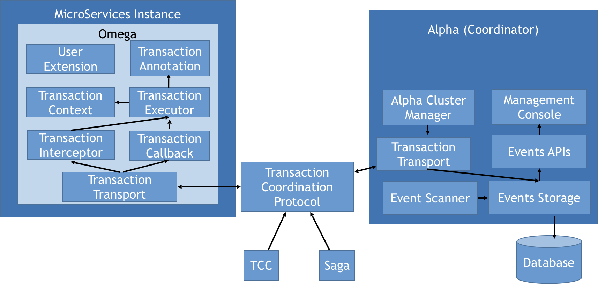

# Saga Pack Design

## BackGround Introduction
The following illustration shows a typical distributed transaction call, in which a user requests a distributed service call, and the initial service calls two participating services in sequence (Service A, Service B). When Service A executes successfully and Service B hits a problem, our distributed transaction need to call  service A's compensation operation to ensure the consistency of the distributed transaction (a single transaction fails and the entire distributed transaction needs to be rolled back), because there is no connection between the two participating services. A coordinator is therefore required to assist with related recovery.

In the process of performing compensation for distributed transactions, we can divide them into two different sets of compensation methods depending on the compensation execution:
* Imperfect Compensation (Saga) - The compensation operation leaves traces of the original transaction operation before, and in general we set the cancellation state in the original transaction record.
* Perfect Compensation (TCC) - The compensation operation thoroughly cleans up the original transaction operation before, and generally does not retain the original transaction transaction, and the user is unaware of the state information before the transaction cancels.

## Overview
Pack contains two components: *alpha* and *omega*. Alpha is the pack leader and backed by database to make sure transaction events stored permanently while omega is the pack worker and embedded inside services to intercept transaction invocation and report events to alpha.

## Omega Internal
Omega plays as an embedded agent inside services. When a service request arrives, omega intercepts its header and retrieve the global transaction id as its global transaction id (Saga event id) and retrieve the local transaction id as its parent transaction id. In pre-process phase, a transaction started event will be recorded in alpha. In post-process phase, a transaction ended event will be recorded in alpha to mark the end of the sub-transaction.

## Inter-Service Communication
The process of Inter-Service Communication is similar to [Zipkin](https://github.com/openzipkin/zipkin)'s. In the producer side, omega intercepts the transaction ids from request to retrieve the transaction context. In the consumer side, omega inject the global transaction ids into request to pass the transaction context. Sub-transactions can chain as a single global transaction by co-operating producers and consumers.

## System Architecture
We can learn more about the relationship between Alpha and Omega modules under the Pack system architecture diagram.

The entire architecture is divided into three parts, one is the Alpha Coordinator (which supports multiple instances to provide highly available support), the other is Omega injected into the microservice instance, and the interaction protocol between Alpha and Omega, which currently supports SagaSaga And TCC two kinds of distributed transaction coordination protocol implementation.

### Omega

Omega contains modules related to analyzing user distributed transaction logic:

* Transaction Annotation: The user adds these labels to their business code to describe the information related to the distributed transaction, so that Omega can handle the processing in accordance with the coordination requirements of the distributed transaction. If you extend your own distributed transactions, you can also do so by defining your own transaction dimensions.

* Transaction Interceptor: In this module we use AOP to intercept user-labeled code to add relevant business logic code, to obtain information related to distributed transactions and local transaction execution, and uses transaction transport module sends events with Alpha.

* Transaction Context: The transaction context provides a means for Omega to pass transaction call information, and with the previously mentioned global transaction ID and the correspondence of local transaction IDs, Alpha can easily retrieve all local transaction event information related to a distributed transaction.

* Transaction Executor: The transaction executor is primarily a module designed to handle transaction call timeouts. Because the connection between Alpha and Omega may be unreliable, it is difficult for the Alpha side to determine whether the Omega local transaction execution timeout is caused by the alpha and Omega's own call, so the transaction executor is designed to monitor omega's local performance simplifies Omega's timeout. The default implementation of Omega is to call the transaction method directly, and Alpha's background service determines whether the transaction execution time times timeout by scanning the event table.

* Transaction Callback: When Omega establishes a connection with Alpha, it registers with Alpha, and when alpha needs to be coordinated, it calls the Omega-registered callback method directly to communicate. Since microservice instances will start and stop frequently in cloud-based scenarios, we cannot assume that Alpha will always be able to find transaction callbacks on the original registration, so we recommend that the microservice instances be stateless, so that Alpha can only communicate with the corresponding Omega based on the service name.

### Transport

Transaction Transport: The transaction transport module is responsible for communication between Omega and Alpha, and in the specific implementation process, Pack defines the transaction interaction methods of TCC and Saga by defining the relevant Grpc description interface file, as well as the events associated with the interaction. We enabled mutual calls between Omega and Alpha with the help of the two-way flow interface provided by Grpc. Omega and Alpha's transmissions are based on Grpc multilingual support and provide the foundation for a multilingual version of Omega.

### Alpha

In order to realize its transactional coordination function, Alpha first needs to receive omega-uploaded events through *Transaction Transport*, and in the *Event Store* module, Alpha uses the Event API to provide event query services to the outside world. Alpha scans the execution event information for distributed transactions through the *Event Scanner*, identifies the time-out transaction, and sends instructions to Omega to complete the transaction coordination. Because Alpha Coordination provides a highly available architecture in a multi-instance approach, this requires *Alpha Cluster Manger* to manage the coordination before alpha cluster instances. Users can monitor the execution of distributed transactions by managing terminals.

* Event Store: Alpha's event storage is currently built on top of the database. To reduce the complexity of system implementations, the highly available architecture of alpha clusters is based on database clusters. To improve the query efficiency of the database, we divide the data store into an online library and an archive library based on the global transaction performance of the event, store the outstanding distributed transaction events in the online library, and store the completed distributed transaction events in the archive library.

* Event API: which exposes as a Restful Event Query Service. This module feature is first applied in the acceptance test of the pack, through the event API acceptance test code can be easily understood the events received internally by Alpha. Acceptance tests verify that the relevant transaction coordination functions are correct by simulating various distributed transaction execution exceptions (errors or timeouts) compared to transaction events received by Alpha.

* Management Console: the management terminal provides a statistical analysis of the performance of a distributed transaction by accessing the Rest service provided by the Event API, and can track the execution of a single global transaction to find out the cause of the failure of the transaction.

* Alpha Cluster Manager: which is responsible for alpha instance registration, managing the execution of individual services in Alpha, and providing Omega with a list of service services that are up-to-date. The cluster manager user can easily implement the start-stop operation of the Alpha service instance and the rolling upgrade capability of the Alpha service instance.

## Workflow Saga
In Saga workflow, the sub transaction need to provide the compensation method. If something is wrong, the Coordinator will send the command to the omega to do the forward or backward recovery.

### Successful Scenario
In a successful scenario, all started events will have a corresponding ended event.

### Exception Scenario
In an exception scenario, omega inside the abnormal service will report an aborted event to alpha. Apha will then send compensate commands to the completed events within the global transaction to make sure all sub-transactions are either completed or rollbacked.

### Timeout Scenario
In timeout scenario, timeouted events will be detected by alpha's period scanner, the corresponding global transaction will be abort at the same time.

## Workflow TCC
Comparing Saga, TCC(try-confirm-cancel) just have one more method(try) to check if we have enough resource to finish the transaction.
 The transaction starter knows all the distributed sub transactions status, so it can work with alpha to confirm or cancel the transactions。
### Successful Scenario
In a successful scenario, all try events are confirmed.

### Exception Scenario
In an exception scenario, the starter will send the cancel event to alpha, and alpha could invoke the cancel methods which are registered to the Alpha server to clean up the pre allocated resources.

