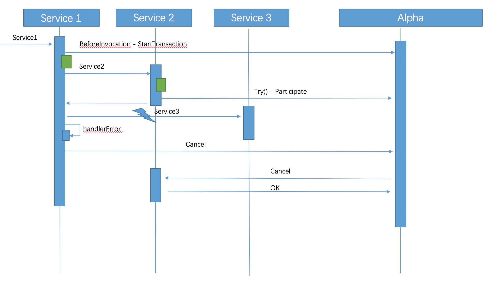

# Saga Pack 设计文档

## 概览
Pack中包含两个组件，即 **alpha** 和 **omega**。
* alpha充当协调者的角色，主要负责对事务的事件进行持久化存储以及协调子事务的状态，使其得以最终与全局事务的状态保持一致。
* omega是微服务中内嵌的一个agent，负责对网络请求进行拦截并向alpha上报事务事件，并在异常情况下根据alpha下发的指令执行相应的补偿操作。

## Omega内部运行机制
omega是微服务中内嵌的一个agent。当服务收到请求时，omega会将其拦截并从中提取请求信息中的全局事务id作为其自身的全局事务id（即Saga事件id），并提取本地事务id作为其父事务id。在预处理阶段，alpha会记录事务开始的事件；在后处理阶段，alpha会记录事务结束的事件。因此，每个成功的子事务都有一一对应的开始及结束事件。

## 服务间通信流程
服务间通信的流程与[Zipkin](https://github.com/openzipkin/zipkin)的类似。在服务生产方，omega会拦截请求中事务相关的id来提取事务的上下文。在服务消费方，omega会在请求中注入事务相关的id来传递事务的上下文。通过服务提供方和服务消费方的这种协作处理，子事务能连接起来形成一个完整的全局事务。

## Saga 具体处理流程
Saga处理场景是要求相关的子事务提供事务处理函数同时也提供补偿函数。Saga协调器alpha会根据事务的执行情况向omega发送相关的指令，确定是否向前重试或者向后恢复。
### 成功场景
成功场景下，每个事务都会有开始和有对应的结束事件。

### 异常场景
异常场景下，omega会向alpha上报中断事件，然后alpha会向该全局事务的其它已完成的子事务发送补偿指令，确保最终所有的子事务要么都成功，要么都回滚。

### 超时场景 (需要调整）
超时场景下，已超时的事件会被alpha的定期扫描器检测出来，与此同时，该超时事务对应的全局事务也会被中断。

## TCC 具体处理流程
TCC(try-confirm-cancel)与Saga事务处理方式相比多了一个Try方法。事务调用的发起方来根据事务的执行情况协调各方相关各方进行提交事务或者回滚事务。
### 成功场景
成功场景下， 每个事务都会有开始和对应的结束事件

### 异常场景
异常场景下，事务发起方会向alpha上报异常事件，然后alpha会向该全局事务的其它已完成的子事务发送补偿指令，确保最终所有的子事务要么都成功，要么都回滚。

