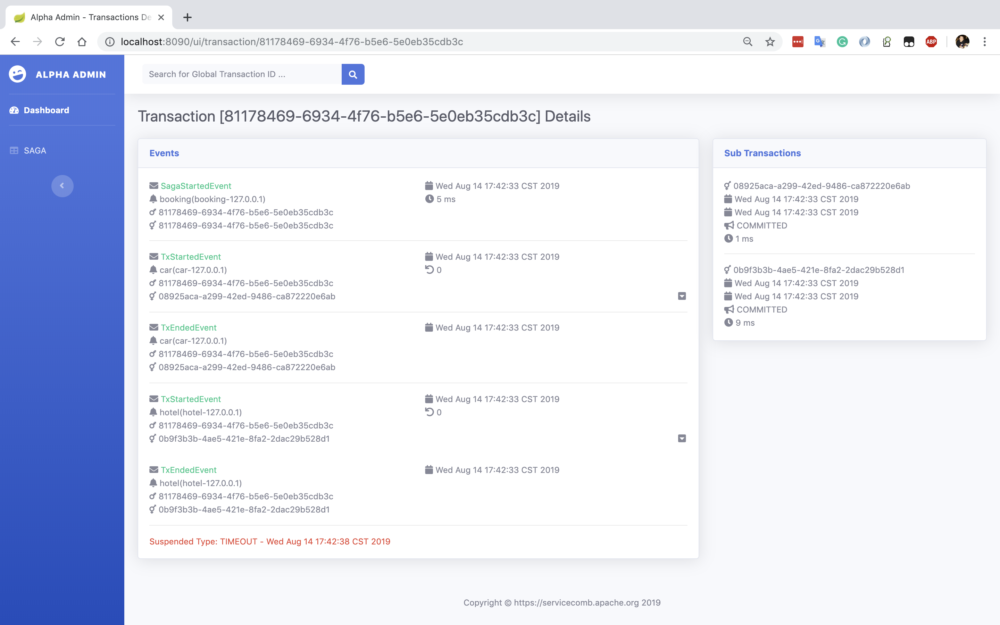

# 状态机模式使用手册

ServiceComb Pack 0.5.0 版本开始我们尝试使用状态机模型解决分布式事务中复杂的事件和状态关系，我们将 Alpha 看作一个可以记录每个全局事务不同状态的的盒子，Alpha 收到 Omega 发送的事务消息（全局事务启动、全局事务停止，全局事务失败，子事务启动，子事务停止，子事务失败等等）后完成一些动作（等待、补偿、超时）和状态切换。

分布式事务的事件使我们面临很复杂的情况，我们希望可以通过一种DSL来清晰的定义状态机，并且能够解决状态机本身的持久化和分布式问题，再经过尝试后我们觉得 Akka FSM 是一个不错的选择。下面请跟我一起体验一下这个新功能。

## 重大更新

* 使用 Akka 状态机代替基于表扫描的状态判断
* 性能提升一个数量级，事件吞吐量每秒1.8w+，全局事务处理量每秒1.2k+
* 内置健康指标采集器，可清晰了解系统瓶颈
* 通过多种数据通道适配实现高可用
* 向前兼容原有 gRPC 协议
* 全新的可视化监控界面
* 开放全新的 API

## 快速开始

ServiceComb Pack 0.5.0 开始支持 Saga 状态机模式，你只需要在启动 Alpha 和 Omega 端程序时增加 `alpha.feature.akka.enabled=true` 参数。你可以在 [docker hub](https://hub.docker.com/r/coolbeevip/servicecomb-pack) 找到一个 docker-compose 文件，也可以按照以下方式部署。

**注意：** 启用状态机模式后，Saga事务会工作在状态机模式，TCC依然采用数据库方式

* 启动 PostgresSQL

  ```bash
  docker run -d -e "POSTGRES_DB=saga" -e "POSTGRES_USER=saga" -e "POSTGRES_PASSWORD=password" -p 5432:5432 postgres
  ```

* 启动 Elasticsearch

  ```bash
  docker run --name elasticsearch -p 9200:9200 -p 9300:9300 -e "discovery.type=single-node" elasticsearch:6.6.2
  ```

* 启动 Alpha

  ```bash
  java -jar alpha-server-${version}-exec.jar \
    --spring.datasource.url=jdbc:postgresql://0.0.0.0:5432/saga?useSSL=false \
    --spring.datasource.username=saga \
    --spring.datasource.password=password \
    --spring.profiles.active=prd \
    --alpha.feature.akka.enabled=true \
    --alpha.feature.akka.transaction.repository.type=elasticsearch \
    --spring.data.elasticsearch.cluster-name=docker-cluster \
    --spring.data.elasticsearch.cluster-nodes=localhost:9300  
  ```

* Alpha WEB 管理界面

  浏览器中打开 http://localhost:8090/admin


### WEB 管理界面

状态机模式开启后，我们还提供了一个简单的管理界面，你可以在这个界面上看到 Alpha 的性能指标、全局事务统计和事务明细

#### 仪表盘


* Dashboard 仪表盘上方显示已经结束的全局事务数量

  TOTAL：总事务数

  SUCCESSFUL：成功结束事务数

  COMPENSATED：成功补偿结束事务数

  FAILED：失败（挂起）事务数

* Active Transactions 活动事务计数器

  COMMITTED：从启动到现在累计成功结束的事务数

  COMPENSATED：从启动到现在累计补偿的事务数

  SUSPENDED：从启动到现在累计挂起的事务数

* Active Transactions 组件计数器

  Events、Actors、Sagas、DB是一组计数器，分别显示Alpha系统中每个处理组件的处理前、处理后计数器以及平均处理事件，通过跟踪这些指标可以了解系统当前的性能以及瓶颈

  Events：显示 Alpha 收到的事件数量、受理的事件数量、拒绝的事件数量、平均每个事件的处理时间

  Actors：显示状态机收到的事件数量、受理的事件数量、拒绝的事件数量、平均每个事件的处理时间

  Sagas：显示开始的全局事务数量、结束的全局事务数量、平均每个全局事务的处理时间

  DB：显示持久化ES组件收到的已结束全局事务数量、持久化到ES中的全局事务数量

* Top 10 Slow Transactions

  显示最慢的前十个事务，点击后可以看到这个慢事务的明细信息

* System Info

   显示了当前 Alpha 服务的系统，JVM，线程等信息

**注意：**Active Transactions 中的指标值重启后自动归零

#### Saga 事务查询列表


事务查询列表可以显示所有已经结束的全局事务的服务ID，服务实例ID，全局事务ID，包含子事务数量、事务耗时、最终结束状态（成功提交、成功补偿、挂起）等，点击一个全局事务后可以查看这个全局事务的明细信息，你也可以在顶部搜索框中输入全局事务ID后快速定位到这个事务。

#### 全局事务明细

全局事务明细页面显示了这个全局事务的事件信息和子事务信息

Events 面板：本事务收到的事件类型、事件时间、发送事件的服务ID和实例ID等详细信息

Sub Transactions 面板：本事务包含的子事务ID，子事务状态，子事务耗时等详细信息

##### 全局事务成功结束


事件卡片右下角的下箭头点击后可以看到子事务的补偿方法信息

##### 全局事务成功补偿结束


红色字体显示收到了一个失败事件，点击右侧红色下箭头可以看到失败的错误堆栈

##### 全局事务失败结束-超时挂起



红色字体显示这个事务由于设置了5秒钟超时，并且在5秒钟后没有收到结束事件而处于挂起状态

##### 全局事务失败结束-非预期事件挂起


因为并没有收到子事务的任何事件，这并不符合状态机预期，所以红色字体显示不可预期挂起

## 集群

可以通过部署多个 Alpha 实现处理能力的水平扩展，集群依赖 Kafka 服务。

* 启动 Kafka，可以使用 docker compose 方式启动，以下是一个 compose 文件样例

  ```yaml
  version: '3.2'
  services:
    zookeeper:
      image: coolbeevip/alpine-zookeeper
      ports:
        - 2181:2181
    kafka:
      image: coolbeevip/alpine-kafka
      environment:
        KAFKA_ADVERTISED_HOST_NAME: 192.168.1.10
        KAFKA_ZOOKEEPER_CONNECT: zookeeper:2181
      ports:
        - 9092:9092
      links:
        - zookeeper
  ```

  **注意：** KAFKA_ADVERTISED_HOST_NAME 一定要配置成服务器的真实 IP 地址，不能配置成 127.0.0.1 或者 localhost

* 启动两个 Alpha 节点  

  启动 Alpha 1

  ```bash
  java -jar alpha-server-${version}-exec.jar \
    --server.port=8090
    --alpha.server.port=8080
    --spring.datasource.url=jdbc:postgresql://0.0.0.0:5432/saga?useSSL=false \
    --spring.datasource.username=saga \
    --spring.datasource.password=password \
    --spring.profiles.active=prd \
    --alpha.feature.akka.enabled=true \
    --alpha.feature.akka.transaction.repository.type=elasticsearch \
    --spring.data.elasticsearch.cluster-name=docker-cluster \
    --spring.data.elasticsearch.cluster-nodes=localhost:9300 \
    --alpha.feature.akka.channel.type=kafka \
    --spring.kafka.bootstrap-servers=192.168.1.10:9092
  ```

  启动 Alpha 2

  ```bash
  java -jar alpha-server-${version}-exec.jar \
    --server.port=8091
    --alpha.server.port=8081
    --spring.datasource.url=jdbc:postgresql://0.0.0.0:5432/saga?useSSL=false \
    --spring.datasource.username=saga \
    --spring.datasource.password=password \
    --spring.profiles.active=prd \
    --alpha.feature.akka.enabled=true \
    --alpha.feature.akka.transaction.repository.type=elasticsearch \
    --spring.data.elasticsearch.cluster-name=docker-cluster \
    --spring.data.elasticsearch.cluster-nodes=localhost:9300 \
    --alpha.feature.akka.channel.type=kafka \
    --spring.kafka.bootstrap-servers=192.168.1.10:9092
  ```

  集群参数说明

  server.port: REST 端口

  alpha.server.port: gRPC 端口

  alpha.feature.akka.channel.type: 数据通道类型配置成 kafka

  spring.kafka.bootstrap-servers: kafka 地址，多个地址逗号分隔

## 后续计划

Akka集群支持

APIs 集成 Swagger

## 附件

[设计文档](design_fsm_zh.md)

[压力测试报告](benchmark_zh.md)


