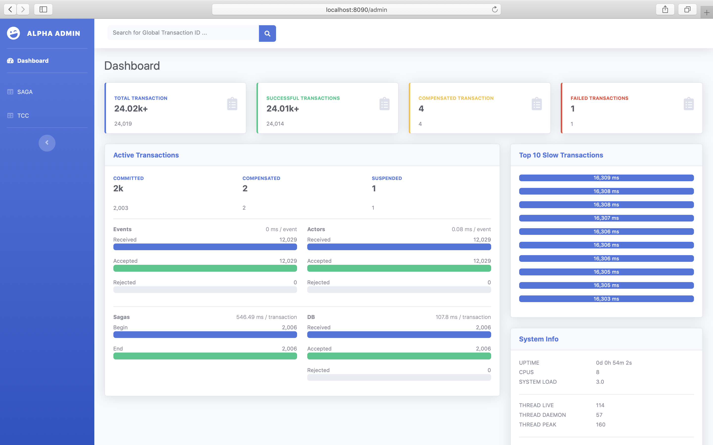
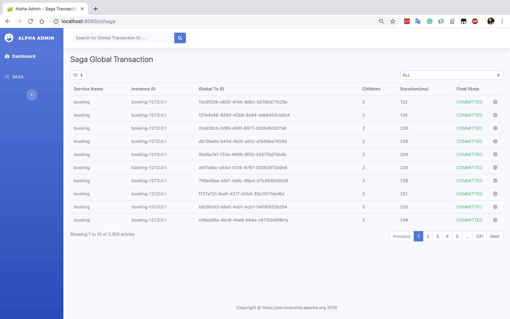
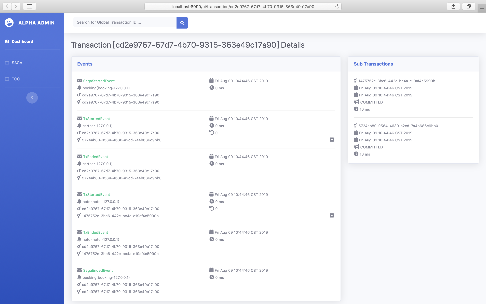
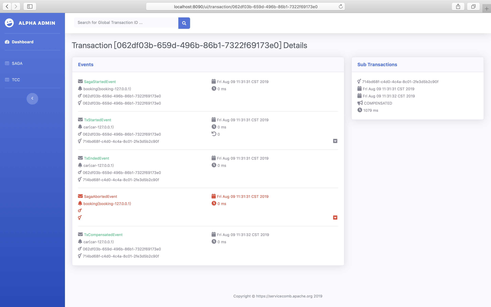

# Alpha With State Machine

## Quick Start

The state machine mode save completed transaction data to elasticsearch

* run elasticsearch with docker

  ```bash
  docker run --name elasticsearch -p 9200:9200 -p 9300:9300 -e "discovery.type=single-node" elasticsearch:6.6.2
  ```

* run Alpha
  use  `alpha.feature.akka.enabled=true`  enabled state machine mode support

  ```bash
  java -jar alpha-server-${version}-exec.jar \
    --spring.datasource.url=jdbc:postgresql://0.0.0.0:5432/saga?useSSL=false \
    --spring.datasource.username=saga-user \
    --spring.datasource.password=saga-password \
    --spring.profiles.active=prd \
    --alpha.feature.akka.enabled=true \
    --alpha.feature.akka.transaction.repository.type=elasticsearch \
    --spring.data.elasticsearch.cluster-name=docker-cluster \
    --spring.data.elasticsearch.cluster-nodes=localhost:9300  
  ```

  **NOTE：**  `spring.data.elasticsearch.cluster-name` is elasticsearch cluster name, default is  `docker-cluster`  when run elasticsearch with docker,  you can query cluster name by  `curl http://localhost:9200/`  

* Omega 

  use  `alpha.feature.akka.enabled=true`  enabled state machine mode support

  ```base
  alpha.feature.akka.enabled=true
  ```

* WEB管理界面

  在浏览器中打开 http://localhost:8090/admin

  Dashboard

  

  Transactions List

  

  Transaction Details - Successful

  

  Transaction Details - Compensated

  
  
  Transaction Details - Failed

  

## Alpha APIs

#### Metrics

You can query Alpha metrics by RESTful API, Use the  `AlphaBenchmark` to simulate sending data and quickly experience this feature.

For exapmle; 10 concurrencies and send 1000 global transactions

```bash
java -jar alpha-benchmark-0.5.0-SNAPSHOT-exec.jar --alpha.cluster.address=0.0.0.0:8080 --w=0 --n=1000 --c=10
```

Query metrics

```bash
curl http://localhost:8090/alpha/api/v1/metrics

{
  nodeType: "MASTER",
  metrics: {
    eventReceived: 8000,
    eventAccepted: 8000,
    eventRejected: 0,
    eventAvgTime: 0,
    actorReceived: 8000,
    actorAccepted: 8000,
    actorRejected: 0,
    actorAvgTime: 0,
    sagaBeginCounter: 1000,
    sagaEndCounter: 1000,
    sagaAvgTime: 9,
    committed: 1000,
    compensated: 0,
    suspended: 0,
    repositoryReceived: 1000,
    repositoryAccepted: 1000,
    repositoryRejected: 0,
    repositoryAvgTime: 0.88
  }
}
```

description

* eventReceived: number of gRPC events received
* eventAccepted:  number of gRPC events accepted（events into the channel）
* eventRejected:  number of gRPC events rejected
* eventAvgTime: average elapsed time on events (milliseconds)
* actorReceived: number of events received by actor
* actorAccepted:  number of events accepted by actor
* actorRejected: number of events rejected by actor
* actorAvgTime: average elapsed time on actor (milliseconds)
* sagaBeginCounter: saga global transaction start counter
* sagaEndCounter: saga global transaction end counter
* sagaAvgTime: average elapsed time on saga global transaction (milliseconds)
* committed: number of committed
* compensated: number of compensated
* suspended: number of suspended
* repositoryReceived: number of events received by the repository component
* repositoryAccepted: number of events accepted by the repository component
* repositoryRejected: number of events rejected by the repository component
* repositoryAvgTime: average elapsed time on save data (milliseconds)

#### Query Transaction

* Query all transactions

  ```bash
  curl -X GET http://localhost:8090/alpha/api/v1/transaction?page=0&size=50
  
  {
    "total": 2002,
    "page": 0,
    "size": 50,
    "elapsed": 581,
    "globalTransactions": [...]
  }
  ```

  Request

  * page

  * size 

  Response

  * total 
  * page
  * size
  * elapsed
  * globalTransactions

* Query transaction by globalTxId

  ```bash
  curl -X GET http://localhost:8090/alpha/api/v1/transaction/{globalTxId}
  
  {
    "globalTxId": "e00a3bac-de6b-498f-99a4-c11d3087fd14",
    "type": "SAGA",
    "serviceName": "alpha-benchmark",
    "instanceId": "alpha-benchmark-127.0.0.1",
    "beginTime": 1564762932963,
    "endTime": 1564762933197,
    "state": "COMMITTED",
    "subTxSize": 3,
    "durationTime": 408,
    "subTransactions": [...],
    "events": [...]
  }
  ```

  Request

  * globalTxId: global transaction id

  Response

  * globalTxId: global transaction id
  * type: SAGA or TCC
  * serviceName: global transaction initiator service name
  * instanceId: global transaction initiator instance id
  * beginTime: global transaction start time
  * endTime: global transaction end time
  * state: global transaction final state (COMMITTED or COMPENSATED or SUSPENDED)
  * subTxSize: number of sub-transaction
  * durationTime
  * subTransactions: sub-transaction list
  * events: event list

## Transactional Data Persistence

Only the end of the transaction will be persisted to Elasticsearch, the transaction data in execution is persisted by Akka.

The end transaction has the following

* End of successfully: final state is COMMITTED

* End of compensation: final state is COMPENSATED

* End of abnormal: final state is SUSPENDED

  The following situations can lead to an abnormal end

  1. timeout
  2. Alpha received an unexpected event, For example, Alpha receive TxEndedEvent before TxStartedEvent or did not receive any sub-transaction events before receiving SagaEndedEvent

### Persistent Configuration

| name                                                         | default | description                                                  |
| ------------------------------------------------------------ | ------- | ------------------------------------------------------------ |
| alpha.feature.akka.transaction.repository.type               |         | Default is not persistent，currently only supports the elasticsearch option |
| alpha.feature.akka.transaction.repository.elasticsearch.memory.size | -1      | Persistence wait queue length, default is Integer.MAX        |
| alpha.feature.akka.transaction.repository.elasticsearch.batchSize | 100     | Batch size                                                   |
| alpha.feature.akka.transaction.repository.elasticsearch.refreshTime | 5000    | Refresh time                                                 |
| spring.data.elasticsearch.cluster-name                       |         | ES集群名称                                                   |
| spring.data.elasticsearch.cluster-nodes                      |         | El;asticsearch address, For example, ip:9300                 |

### Elasticsearch Index Name
Alpha will automatically create an index  `alpha_global_transaction` 

### Query By Elasticsearch APIs  

* Query all transactions

  ```bash
  curl http://localhost:9200/alpha_global_transaction/_search
  ```

* Query transaction by globalTxId

  ```bash
  curl -X POST http://localhost:9200/alpha_global_transaction/_search -H 'Content-Type: application/json' -d '
  {
    "query": {
      "bool": {
        "must": [{
          "term": {
            "globalTxId.keyword": "974d089a-5476-48ed-847a-1e338456809b"
          }
        }],
        "must_not": [],
        "should": []
      }
    },
    "from": 0,
    "size": 10,
    "sort": [],
    "aggs": {}
  }'
  ```

* Result json data

  ```json
  {
    "took": 17,
    "timed_out": false,
    "_shards": {
      "total": 5,
      "successful": 5,
      "skipped": 0,
      "failed": 0
    },
    "hits": {
      "total": 4874,
      "max_score": 1.0,
      "hits": [{
        "_index": "alpha_global_transaction",
        "_type": "alpha_global_transaction_type",
        "_id": "209791a0-34f4-40da-807e-9c5b8786dd61",
        "_score": 1.0,
        "_source": {
          "globalTxId": "209791a0-34f4-40da-807e-9c5b8786dd61",
          "type": "SAGA",
          "serviceName": "alpha-benchmark",
          "instanceId": "alpha-benchmark-127.0.0.1",
          "beginTime": 1563982631298,
          "endTime": 1563982631320,
          "state": "COMMITTED",
          "subTxSize": 3,
          "durationTime": 22,
          "subTransactions": [...],
          "events": [...]
        }
      },{...}]
    }
  }
  ```

* Result data sample

  ```json
  {
    "took": 17,
    "timed_out": false,
    "_shards": {
      "total": 5,
      "successful": 5,
      "skipped": 0,
      "failed": 0
    },
    "hits": {
      "total": 4874,
      "max_score": 1.0,
      "hits": [{
        "_index": "alpha_global_transaction",
        "_type": "alpha_global_transaction_type",
        "_id": "209791a0-34f4-40da-807e-9c5b8786dd61",
        "_score": 1.0,
        "_source": {
          "globalTxId": "209791a0-34f4-40da-807e-9c5b8786dd61",
          "type": "SAGA",
          "serviceName": "alpha-benchmark",
          "instanceId": "alpha-benchmark-127.0.0.1",
          "beginTime": 1563982631298,
          "endTime": 1563982631320,
          "state": "COMMITTED",
          "subTxSize": 3,
          "durationTime": 22,
          "subTransactions": [{
            "localTxId": "03fe15b2-a070-4e55-9b5b-801c2181dd0a",
            "parentTxId": "209791a0-34f4-40da-807e-9c5b8786dd61",
            "beginTime": 1563982631308,
            "endTime": 1563982631309,
            "state": "COMMITTED",
            "durationTime": 1
          }, {
            "localTxId": "923f83fd-0bce-4fac-8c89-ecbe7c5e9106",
            "parentTxId": "209791a0-34f4-40da-807e-9c5b8786dd61",
            "beginTime": 1563982631320,
            "endTime": 1563982631320,
            "state": "COMMITTED",
            "durationTime": 0
          }, {
            "localTxId": "95821ce3-2202-4e55-9343-4e6a6519821f",
            "parentTxId": "209791a0-34f4-40da-807e-9c5b8786dd61",
            "beginTime": 1563982631309,
            "endTime": 1563982631309,
            "state": "COMMITTED",
            "durationTime": 0
          }],
          "events": [{
            "serviceName": "alpha-benchmark",
            "instanceId": "alpha-benchmark-127.0.0.1",
            "globalTxId": "209791a0-34f4-40da-807e-9c5b8786dd61",
            "parentTxId": "209791a0-34f4-40da-807e-9c5b8786dd61",
            "localTxId": "209791a0-34f4-40da-807e-9c5b8786dd61",
            "createTime": 1563982631298,
            "timeout": 0,
            "type": "SagaStartedEvent"
          }, {
            "serviceName": "alpha-benchmark",
            "instanceId": "alpha-benchmark-127.0.0.1",
            "globalTxId": "209791a0-34f4-40da-807e-9c5b8786dd61",
            "parentTxId": "209791a0-34f4-40da-807e-9c5b8786dd61",
            "localTxId": "03fe15b2-a070-4e55-9b5b-801c2181dd0a",
            "createTime": 1563982631299,
            "compensationMethod": "service a",
            "payloads": "AQE=",
            "retryMethod": "",
            "retries": 0,
            "type": "TxStartedEvent"
          }, {
            "serviceName": "alpha-benchmark",
            "instanceId": "alpha-benchmark-127.0.0.1",
            "globalTxId": "209791a0-34f4-40da-807e-9c5b8786dd61",
            "parentTxId": "209791a0-34f4-40da-807e-9c5b8786dd61",
            "localTxId": "03fe15b2-a070-4e55-9b5b-801c2181dd0a",
            "createTime": 1563982631301,
            "type": "TxEndedEvent"
          }, {
            "serviceName": "alpha-benchmark",
            "instanceId": "alpha-benchmark-127.0.0.1",
            "globalTxId": "209791a0-34f4-40da-807e-9c5b8786dd61",
            "parentTxId": "209791a0-34f4-40da-807e-9c5b8786dd61",
            "localTxId": "95821ce3-2202-4e55-9343-4e6a6519821f",
            "createTime": 1563982631302,
            "compensationMethod": "service b",
            "payloads": "AQE=",
            "retryMethod": "",
            "retries": 0,
            "type": "TxStartedEvent"
          }, {
            "serviceName": "alpha-benchmark",
            "instanceId": "alpha-benchmark-127.0.0.1",
            "globalTxId": "209791a0-34f4-40da-807e-9c5b8786dd61",
            "parentTxId": "209791a0-34f4-40da-807e-9c5b8786dd61",
            "localTxId": "95821ce3-2202-4e55-9343-4e6a6519821f",
            "createTime": 1563982631304,
            "type": "TxEndedEvent"
          }, {
            "serviceName": "alpha-benchmark",
            "instanceId": "alpha-benchmark-127.0.0.1",
            "globalTxId": "209791a0-34f4-40da-807e-9c5b8786dd61",
            "parentTxId": "209791a0-34f4-40da-807e-9c5b8786dd61",
            "localTxId": "923f83fd-0bce-4fac-8c89-ecbe7c5e9106",
            "createTime": 1563982631309,
            "compensationMethod": "service c",
            "payloads": "AQE=",
            "retryMethod": "",
            "retries": 0,
            "type": "TxStartedEvent"
          }, {
            "serviceName": "alpha-benchmark",
            "instanceId": "alpha-benchmark-127.0.0.1",
            "globalTxId": "209791a0-34f4-40da-807e-9c5b8786dd61",
            "parentTxId": "209791a0-34f4-40da-807e-9c5b8786dd61",
            "localTxId": "923f83fd-0bce-4fac-8c89-ecbe7c5e9106",
            "createTime": 1563982631311,
            "type": "TxEndedEvent"
          }, {
            "serviceName": "alpha-benchmark",
            "instanceId": "alpha-benchmark-127.0.0.1",
            "globalTxId": "209791a0-34f4-40da-807e-9c5b8786dd61",
            "parentTxId": "209791a0-34f4-40da-807e-9c5b8786dd61",
            "localTxId": "209791a0-34f4-40da-807e-9c5b8786dd61",
            "createTime": 1563982631312,
            "type": "SagaEndedEvent"
          }]
        }
      }]
    }
  }
  ```

  more references [Elasticsearch APIs](https://www.elastic.co/guide/en/elasticsearch/reference/6.6/docs.html) 

## High Availability

You can achieve high availability of services by deploying an Alpha cluster. You can choose the type of event channel by parameter itself.

### Event Channel Type

Alpha receives the event sent by Omega and puts it into the event channel to wait for Akka processing.

| Type                 | 模式         | description                                                  |
| -------------------- | ------------ | ------------------------------------------------------------ |
| memory（default）    | single       | Using memory as data channel, **Not recommended for use in production environments** |
| redis（coming soon） | master-slave | Using redis PUB/SUB as data channel. Only the primary node is responsible for processing the data, After the master node is down, the slave node switches to the master node. |
| kafka（coming soon） | cluster      | Using Kafka as the data channel and global transaction ID as the partitioning strategy, support horizontally scalable. |

* Memory channel

| name                                   | default | description                        |
| -------------------------------------- | ------- | ---------------------------------- |
| alpha.feature.akka.channel.type        | memory  |                                    |
| alpha.feature.akka.channel.memory.size | -1      | queue size, default is Integer.MAX |

* Redis channel

  coming soon

* Kafka channel

  coming soon

### Akka Configuration

Use the prefix `akkaConfig` before the parameter name of akka

### Akka Persistence

* Default

```properties
akkaConfig.akka.persistence.journal.plugin=akka.persistence.journal.inmem
akkaConfig.akka.persistence.journal.leveldb.dir=target/example/journal
akkaConfig.akka.persistence.snapshot-store.plugin=akka.persistence.snapshot-store.local
akkaConfig.akka.persistence.snapshot-store.local.dir=target/example/snapshots
```

* Redis

```properties
akkaConfig.akka.persistence.journal.plugin=akka-persistence-redis.journal
akkaConfig.akka.persistence.snapshot-store.plugin=akka-persistence-redis.snapshot
akkaConfig.akka-persistence-redis.redis.mode=simple
akkaConfig.akka-persistence-redis.redis.host=localhost
akkaConfig.akka-persistence-redis.redis.port=6379
akkaConfig.akka-persistence-redis.redis.database=0
```

more references [akka-persistence-redis](https://index.scala-lang.org/safety-data/akka-persistence-redis/akka-persistence-redis/0.4.0?target=_2.11)

Usage example

```bash
java -jar alpha-server-${version}-exec.jar \
  --spring.datasource.url=jdbc:postgresql://0.0.0.0:5432/saga?useSSL=false \
  --spring.datasource.username=saga-user \
  --spring.datasource.password=saga-password \
  --spring.profiles.active=prd \
  --alpha.feature.akka.enabled=true \
  --alpha.feature.akka.transaction.repository.type=elasticsearch \
  --spring.data.elasticsearch.cluster-name=docker-cluster \
  --spring.data.elasticsearch.cluster-nodes=localhost:9300 \
  --akkaConfig.akka.persistence.journal.plugin=akka-persistence-redis.journal \
  --akkaConfig.akka.persistence.snapshot-store.plugin=akka-persistence-redis.snapshot \
  --akkaConfig.akka-persistence-redis.redis.mode=simple \
  --akkaConfig.akka-persistence-redis.redis.host=localhost \
  --akkaConfig.akka-persistence-redis.redis.port=6379 \
  --akkaConfig.akka-persistence-redis.redis.database=0  
```

### Akka Cluster

coming soon

## Appendix

[design document](design_fsm_zh.md)

[benchmark](benchmark_zh.md)