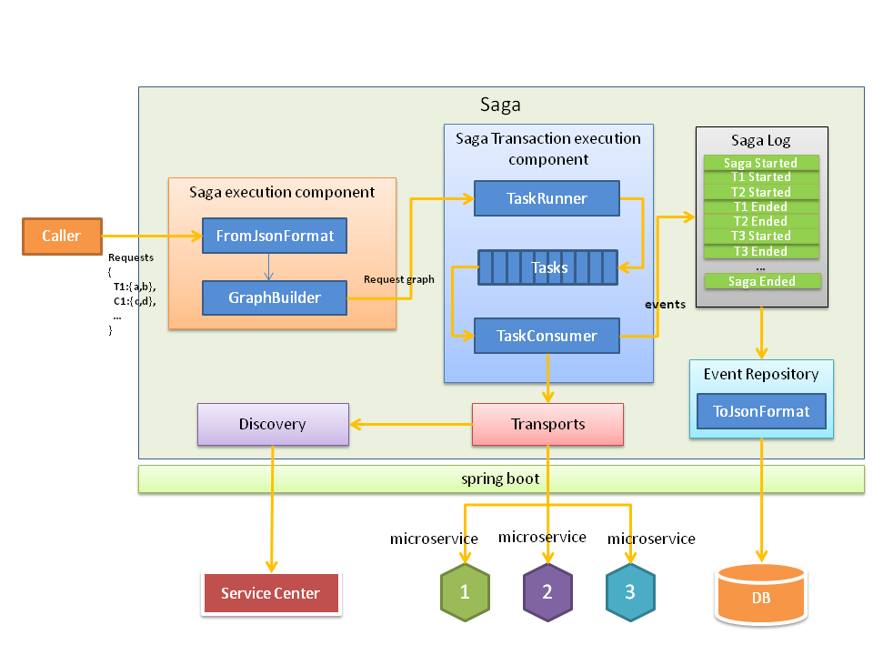

# Previous Saga's Documentation
## Major Architecture of Saga
* saga-core(transaction and compensation handling logic)
* saga-format(data serialization and deserialization)
* saga-transports(communication protocol implementation such as rest or rpc in the future)
* saga-discovery(service discovery)
* saga-spring(restful service framework)

 

## Prerequisites
You will need:
1. [Oracle JDK 1.8+][jdk]
2. [Maven 3.x][maven]
3. [Docker][docker]
4. [PostgreSQL][postgres]
5. [Service Center(optional)][service_center]
6. [Docker compose(optional)][docker_compose]
7. [Docker machine(optional)][docker_machine]

[jdk]: http://www.oracle.com/technetwork/java/javase/downloads/jdk8-downloads-2133151.html
[maven]: https://maven.apache.org/install.html
[docker]: https://www.docker.com/get-docker
[postgres]: https://www.postgresql.org/download/
[service_center]: https://github.com/apache/incubator-servicecomb-service-center
[docker_compose]: https://docs.docker.com/compose/install/
[docker_machine]: https://docs.docker.com/machine/install-machine/

## Building
Download the source code.
```
git clone https://github.com/apache/incubator-servicecomb-saga.git
```

Enter the Saga root directory,build Saga project by maven command and generate a docker image named saga-spring in local.
```
mvn package -DskipTests -Pdocker
```

## Run Services
A `docker-compose.yaml` file is provided to start Saga services and its dependencies(Service center and Mysql) as docker containers.
User also can configure specified Service center or Mysql in `docker-compose.yaml`.

Enter the Saga root directory, run all service images using command,
```
docker-compose up
```

## Reference API
See [Saga API](docs/api/api.md) for details.

## Example
See [Saga demo](https://github.com/apache/incubator-servicecomb-saga/tree/master/saga-demo) for details.
