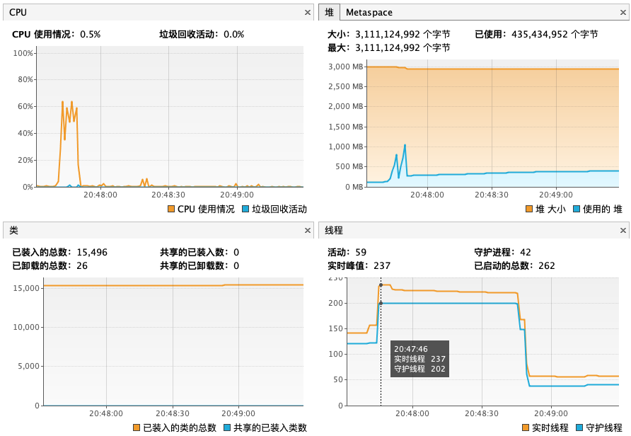
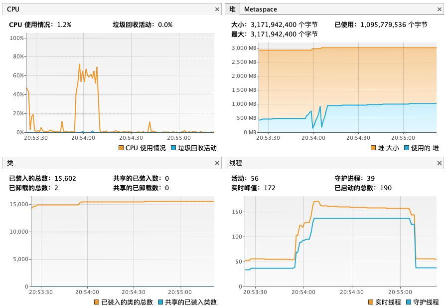

# Benchmark for Alpha

基准测试使用 alpha-benchmark 工具模拟发送事务，模拟器和Alpha分别部署在两个不同的服务器

## 配置

### 物理服务器配置

| 名称     | 描述                                                        |
| -------- | ----------------------------------------------------------- |
| 服务器   | Dell PowerEdge R720xd                                       |
| CPU      | Intel(R) Xeon(R) CPU E5-2620 v2 @ 2.10GHz                   |
| 核数     | 24                                                          |
| 内存     | 128G                                                        |
| 硬盘     | 机械                                                        |
| 网卡     | Broadcom Corporation NetXtreme BCM5720 Gigabit Ethernet * 4 |
| 管理程序 | VMware ESXi, 6.0.0, 3073146                                 |

### 虚拟机

| 服务器 | CPU  | 内存 | 磁盘 | 网络     |      |
| ------ | ---- | ---- | ---- | -------- | ---- |
| VM     | 4    | 16   | 200G | VMXNET 3 |      |
| VM     | 4    | 16   | 200G | VMXNET 3 |      |

### 网络带宽

> 服务器之间共享网络带宽（6.94 Gbits/sec）

```shell
[ ID] Interval           Transfer     Bandwidth       Retr  Cwnd
[  4]   0.00-1.00   sec   695 MBytes  5.83 Gbits/sec  136    711 KBytes
[  4]   1.00-2.00   sec   776 MBytes  6.51 Gbits/sec    0    960 KBytes
[  4]   2.00-3.00   sec   882 MBytes  7.41 Gbits/sec    0    960 KBytes
[  4]   3.00-4.00   sec  1.04 GBytes  8.89 Gbits/sec    0   1.08 MBytes
[  4]   4.00-5.00   sec   946 MBytes  7.93 Gbits/sec    0   1.08 MBytes
[  4]   5.00-6.00   sec   736 MBytes  6.18 Gbits/sec    0   1.11 MBytes
[  4]   6.00-7.00   sec   726 MBytes  6.09 Gbits/sec    0   1.16 MBytes
[  4]   7.00-8.00   sec   829 MBytes  6.95 Gbits/sec    0   1.20 MBytes
[  4]   8.00-9.00   sec  1009 MBytes  8.46 Gbits/sec  813    440 KBytes
[  4]   9.00-10.00  sec   615 MBytes  5.16 Gbits/sec    0    641 KBytes
- - - - - - - - - - - - - - - - - - - - - - - - -
[ ID] Interval           Transfer     Bandwidth       Retr
[  4]   0.00-10.00  sec  8.08 GBytes  6.94 Gbits/sec  949             sender
[  4]   0.00-10.00  sec  8.08 GBytes  6.94 Gbits/sec                  receiver
```

### 操作系统配置

* ulimit -n 65535

### Alpha配置

```bash
java \
  -Xmx8g -Xms8g -Xmn4g \
  -Xss256k \
  -XX:PermSize=128m -XX:MaxPermSize=512m \
  -XX:+UseConcMarkSweepGC \
  -XX:+UseParNewGC \
  -XX:MaxTenuringThreshold=15 \
  -XX:+ExplicitGCInvokesConcurrent \
  -XX:+CMSParallelRemarkEnabled \
  -XX:SurvivorRatio=8 \
  -XX:+UseCompressedOops \
  -Dcom.sun.management.jmxremote \
  -Dcom.sun.management.jmxremote.port=9090 \
  -Dcom.sun.management.jmxremote.ssl=false \
  -Dcom.sun.management.jmxremote.authenticate=false \
  -jar alpha-server-0.7.0-SNAPSHOT-exec.jar \
  --alpha.spec.names=saga-akka \
  --alpha.spec.saga.akka.repository.name=elasticsearch \
  --alpha.spec.saga.akka.repository.elasticsearch.uris=http://127.0.0.1:9200 \
  --spring.profile.active=prd \
  --alpha.feature.nativetransport=true
```

## 测试报告

总结：

* 0.5.0 Akka的性能比0.4.0版本提升一个数量级，吞吐率最高可达到每秒1351笔全局事务，每笔全局事务包含包含3个子事务，Alpha gPRC 接口吞吐量 1.8w/每秒
* 0.6.0版本单节点Alpha最优并发量为 500～1000，平均耗<1s，吞吐率 1900+/秒, CPU利用率稳定工作在80%
* 本测试客户端和服务端分别部署在不同的服务器，模拟真实网络通讯
* Alpha估算：Alpha部署数量=最大吞吐量/1900

| 版本 | 并发数 | 总耗时(s) | 平均耗时(ms) | 吞吐率 | 事务量 |
| ------ | ------ | --------- | ---- | ------ | ---- |
| 0.5.0 without Akka | 100    | 102       | 1026 | 98/sec | 10000 |
| 0.5.0 without Akka | 500    | 99      | 4970 | 101/sec | 10000 |
| 0.5.0 with Akka | 100  | 14      | 142 | 714/sec | 10000 |
| 0.5.0 with Akka | 500  | 8      | 418 | 1250/sec | 10000 |
| 0.5.0 with Akka | 1000 | 8       | 858 | 1250/sec | 10000 |
| 0.5.0 with Akka | 2000 | 14      | 2888 | 714/sec | 10000 |
| 0.5.0 with Akka | 1000   | 39      | 786 | 1282/sec | 50000 |
| 0.5.0 with Akka | 2000 | 37 | 1519 | 1351/sec | 50000 |
| 0.5.0 with Akka | 3000 | 43 | 2687 | 1116/sec | 50000 |
| 0.6.0 with Akka | 500 | 7 | 373 | 1428/sec | 10000 |
| 0.6.0 with Akka | 500 | 26 | 267 | 1923/sec | 50000 |
| 0.6.0 with Akka | 1000 | 27 | 552 | 1851/sec | 50000 |
| 0.6.0 with Akka | 2000 | 28 | 1139 | 1785/sec | 50000 |

集群场景

* 使用5台服务器，分别部署2节点Alpha集群和3节点模拟客户端
* 使用 Alpha 0.6.0 版本并开启 `alpha.feature.nativetransport=true` 参数

| 客户端 | 并发数 | 总耗时(s) | 平均耗时(ms) | 吞吐率 | 事务量 |
| ------ | ------ | --------- | ---- | ------ | ---- |
| 客户端1 | 500    | 39       | 392 | 1282/sec | 50000 |
| 客户端2 | 500    | 38       | 388 | 1315/sec | 50000 |
| 客户端3 | 500    | 39       | 393 | 1282/sec | 50000 |

通过集群部署 Alpha 可以水平扩展吞吐率，两节点集群的 QPS 约为3879，并且单节点 Alpha 的健康度指标看起来不错

* Events 接收 Omega 消息平均耗时约 0.39～9 毫秒
* Actors 发送分片消息平均耗时约0～0.02毫秒
*  Sagas 单笔全局事务处理平均耗时约20.13~23.84毫秒
* DB 单笔全局事务持久化平均耗时约1.81~1.98毫秒

Alpha Node 1


Alpha Node 2


## 测试详细说明

### Alpha 0.5.0 without Akka

#### 测试1

- 全局事务量 10000

- 并发数 100

  

  

#### 测试2

- 全局事务量 10000

- 并发数 500

  

  

### Alpha 0.5.0 with Akka

测试工具模拟发送全局事务，通过多线程模拟并发（一个全局事务包含8条消息）

#### 测试1

* 全局事务量 10000

* 并发数 100

  

  

#### 测试2

* 全局事务量 10000

* 并发数 500

  

  

#### 测试3

- 全局事务量 10000

- 并发数 1000

  

  

#### 测试4

- 全局事务量 10000

- 并发数 2000

  

  

#### 测试5

- 全局事务量 50000

- 并发数 1000

  

  

#### 测试6

- 全局事务量 50000

- 并发数 2000

  

  

#### 测试7

- 全局事务量 50000

- 并发数 3000

  

  