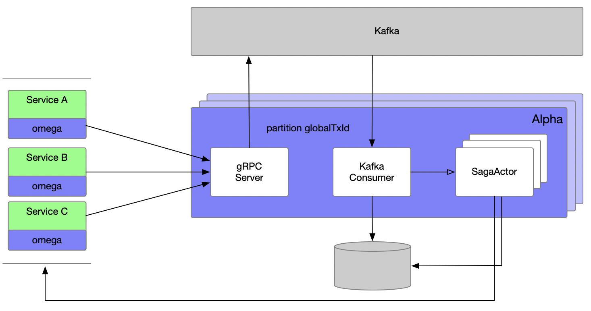
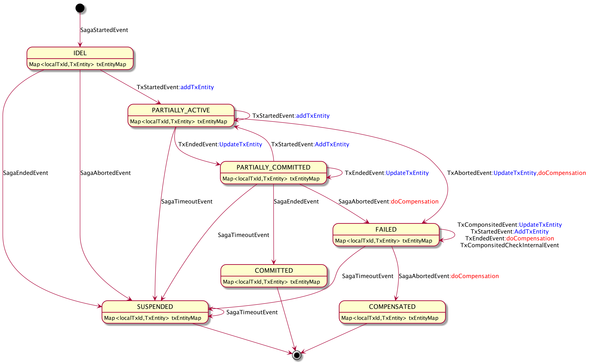

# Saga 状态机设计文档

## 概览

在不改变 Omega 和 Alpha 之间通信协议的前提下，基于 kafka 和 Akka FSM 实现事务消息的分布式处理，提升集群处理性能。

* Omega 和 Alpha 之间的通信协议保持 gRPC 不变
* Alpha 收到事务消息后写入 kafka，采用 globalTxId 作为分区条件，确保同一个完整事务的所有消息在消费端有序处理
* Alpha 消费 kafka 中的事物消息，并创建 Saga Actor 对象实现事务状态的转换和跟踪

## 事件定义

事件在 Omega 侧创建，并通过 gRPC 发送给 Alpha

| 名称               | 缩写 | 描述                                                         |
| ------------------ | ---- | ------------------------------------------------------------ |
| SagaStartedEvent   | Ess  | 全局事务开始                                                 |
| SagaEndedEvent     | Ese  | 全局事务结束                                                 |
| SagaAbortedEvent   | Esa  | 全局事务失败，当Omega侧拦截到非超时类异常时将发送此事件      |
| SagaTimeoutEvent   | Est | 全局事务超时，当Omega侧拦截到请求出现网络超时、请求超时、全局事务自定义超时的时候Omega组件会中断请求线程并发送此事件 |
| TxStartedEvent     | Ets  | 子事务开始                                                   |
| TxEndedEvent       | Ete  | 子事务结束                                                   |
| TxAbortedEvent     | Eta  | 子事务失败                                                   |
| TxComponsitedEvent | Etc  | 子事务补偿成功                                               |

## 状态机设计

> 状态机基于 Akka FSM 实现，基于Akka 的持久化和集群能力实现高可用

由于状态机的设计必须遵许已知的事件类型和顺序，而事件的发送又依赖于开发者对于 Omega 组件的使用，为了避免未知的情况出现而导致的不可控情况，本设计遵循以下约定

* 状态机只处理已知的有序事件组合情况
* 对于未知的事件组合情况统一将状态设置成 SUSPENDED 并结束
* 对于 SagaTimeoutEvent 事件统一将状态设置成 SUSPENDED 并结束
* 状态机内部会记录完整的事件记录以及状态转换记录，以便于问题的分析以及手动补偿

### 状态定义

| 名称                | 描述                                                         |
| ------------------- | ------------------------------------------------------------ |
| IDEL                | 空闲状态：Actor 创建后的初始化状态                   |
| READY    | 就绪状态：收到全局务开始事件  `SagaStartedEvent` 后的状态 |
| PARTIALLY_ACTIVE    | 部分开始状态：收到了子事务开始事件  `TxStartedEvent` 后的状态 |
| PARTIALLY_COMMITTED | 部分提交状态：收到了事务结束事件 `TxEndedEvent` 后的状态     |
| FAILED              | 失败状态：全局事务失败状态，当收到 `TxAbortedEvent` 或者 `SagaAbortedEvent` 事件满足进入此状态后将对所有已提交的子事务进行补偿，并在此状态等待所有 `TxComponsitedEvent` 收到后转换为 `COMPENSATED` 状态并终止。考虑到并行子事务的可能性，在此状态下收到 `TxEndedEvent` 事件后也将调用补偿方法 |
| COMMITTED           | 已提交状态：全局事务正常结束状态，所有子事物都已经提交       |
| COMPENSATED         | 已补偿状态：全局事务正常结束状态，所有已经提交的子事务补偿成功 |
| SUSPENDED           | 挂起状态：全局事务异常结束状态，当出现不符合预期的事件状态组合或者收到 `SagaTimeoutEvent` 事件时将进入挂起状态，设计挂起状态的目的是为了避免问题扩散，此时需要人工介入处理 |

### 状态转换表

状态转换表定义了事件与状态的转换关系

## 关于超时

无论是否设置了@SagaStart @Compensable 的 timeout 参数，当方法执行时间过长的情况下超时是无法避免的，并且当超时发生时我们无法预测子事务是否执行成功。例如：

* request timeout 会导致 Omega 发送 SagaTimeoutEvent
* connection timeout 会导 Omega 发送 SagaTimeoutEvent

我们可以控制是通过 Omega 发送 SagaTimeoutEvent 触发超时挂起，还是通过SagaActor内部超时出发挂起

* @SagaStart timeout>0，SagaActor会监控超时时间并触发挂起
* @SagaStart timeout=0，必须确保 Omega 正常发送 SagaTimeoutEvent 后能触发挂起

**注意：** 建议 @Compensable timeout < request timeout 或者 < connection timeout

**注意：** 建议 @SagaStart timeout < request timeout 或者 < connection timeout

## 测试场景

测试场景中列举已知的事件顺序组合，用于进行状态机的单元测试，为了确保测试数据的完善性采用三个子事务方式，这样可以保证子事务数据存在上一条、本条、下一条。

### 正常结束的场景

> 正常结束的场景包括事务全部提交正常结束，事务部分失败并补偿成功正常结束

* 成功场景

  1. SagaStartedEvent-1
  2. TxStartedEvent-11
  3. TxEndedEvent-11
  4. TxStartedEvent-12
  5. TxEndedEvent-12
  6. TxStartedEvent-13
  7. TxEndedEvent-13
  8. SagaEndedEvent-1

* 第一个子事务失败场景

  1. SagaStartedEvent-1
  2. TxStartedEvent-11
  3. TxAbortedEvent-11（失败）
  4. SagaAbortedEvent-1

* 中间子事务失败场景

  1. SagaStartedEvent-1
  2. TxStartedEvent-11
  3. TxEndedEvent-11
  4. TxStartedEvent-12
  5. TxAbortedEvent-12（失败）
  6. TxComponsitedEvent-11（补偿完成）
  7. SagaAbortedEvent-1

* 最后一个子事务失败场景

  1. SagaStartedEvent-1
  2. TxStartedEvent-11
  3. TxEndedEvent-11
  4. TxStartedEvent-12
  5. TxEndedEvent-12
  6. TxStartedEvent-13
  7. TxAbortedEvent-13（失败）
  8. TxComponsitedEvent-11（补偿完成）
  9. TxComponsitedEvent-12（补偿完成）
  10. SagaAbortedEvent-1

* 并发子事务失败场景

  1. SagaStartedEvent-1
  2. TxStartedEvent-11
  3. TxAbortedEvent-11（失败）
  4. TxStartedEvent-12
  5. TxEndedEvent-12
  6. TxComponsitedEvent-12（补偿完成）
  7. TxStartedEvent-13
  8. TxEndedEvent-13
  9. TxComponsitedEvent-13（补偿完成）
  10. SagaAbortedEvent-1

* 子事务全部完成后异常场景

  > 这种情况令人困惑，但是是可以预见的，例如所有子事务完成后调用了一些中间件失败

  1. SagaStartedEvent-1
  2. TxStartedEvent-11
  3. TxEndedEvent-11
  4. TxStartedEvent-12
  5. TxEndedEvent-12
  6. TxStartedEvent-13
  7. TxEndedEvent-13
  8. SagaAbortedEvent-1（失败）
  9. TxComponsitedEvent-11（补偿完成）
  10. TxComponsitedEvent-12（补偿完成）
  11. TxComponsitedEvent-13（补偿完成）

### 非正常结束的场景

> 当状态机无法明确的进行状态转换时将进入挂起状态 `SUSPENDED` ，例如：收到了超时事件 ` SagaTimeoutEvent` ，此时我们无法确定超时的子事务是否已经执行成功。对于挂起的全局事务需要进行人为干预。
>
> **注意：**当 `@SagaStart timeout=0` 时可能存在 SagaActor永远无法销毁的情况 

* SagaStart timeout > 0
  * Omega 发送 SagaTimeoutEvent

    > 此处需要测试在每个子事务发送后出现超时事件的场景，这里就不一一列举了。

    1. SagaStartedEvent-1
    2. TxStartedEvent-11
    3. TxEndedEvent-11
    4. TxStartedEvent-12
    5. SagaTimeoutEvent-1（超时事件）

  * Omega 发送 SagaTimeoutEvent 失败

    > 由于设置了 @SagaStart timeout 所以 SagaActor 会触发挂起

    1. SagaStartedEvent-1
    2. TxStartedEvent-11
    3. TxEndedEvent-11
    4. TxStartedEvent-12

* SagaStart timeout = 0

  > 应尽量避免 timeout=0，因为这将导致 SagaActor 自己不会触发超时挂起，那么这个Actor将可能永远不会销毁，最终导致累计大量Actor后内存溢出。我们需要监控这种情况通过Alpha的健康度指标体现并允许手动处理。
