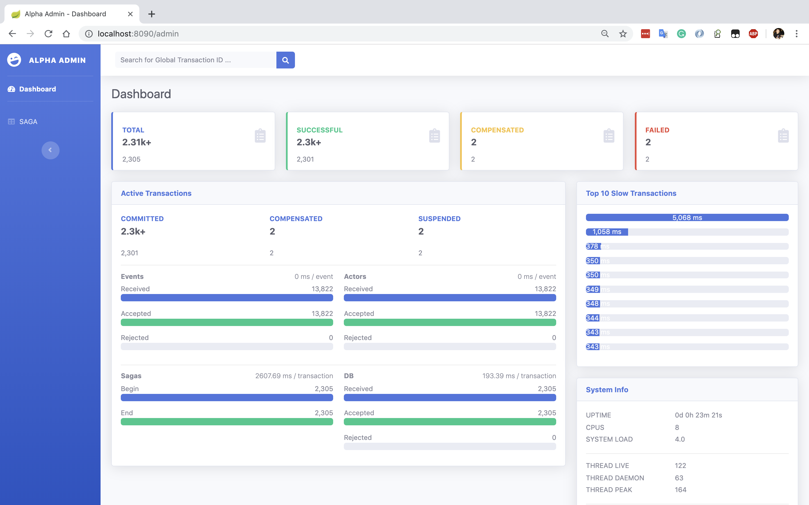
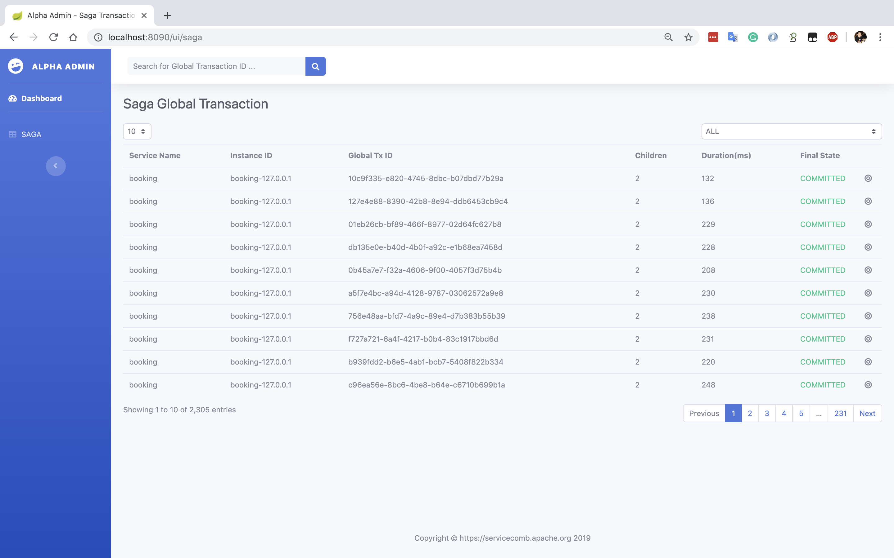
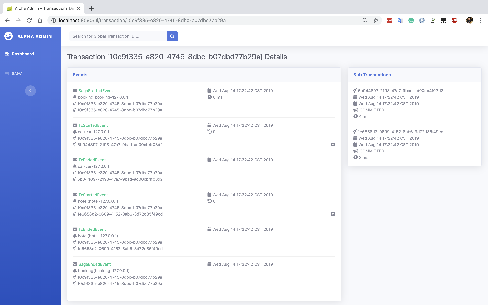
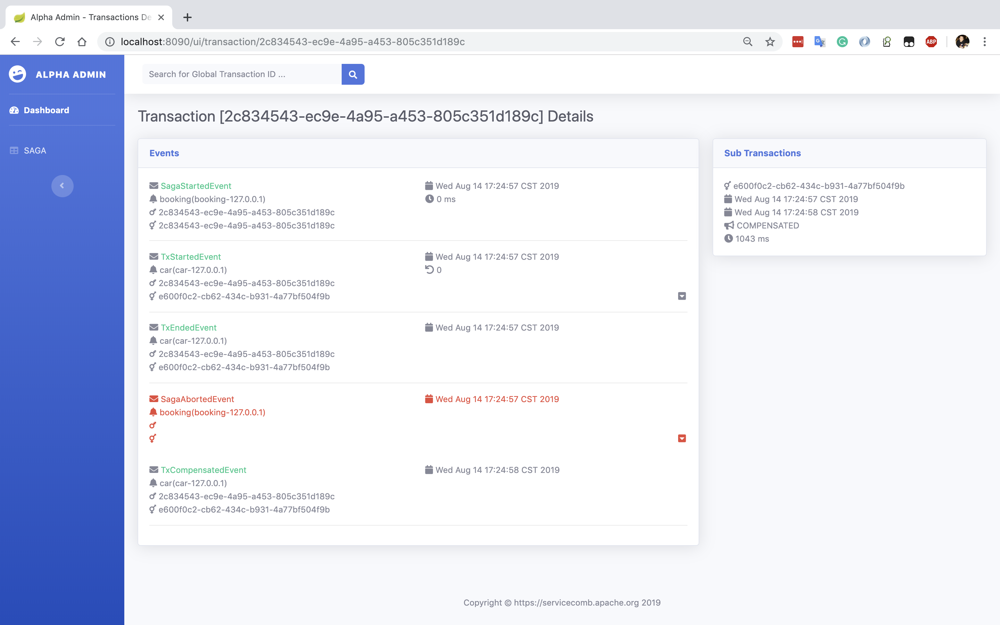
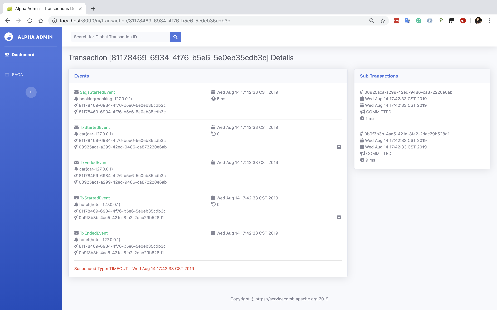
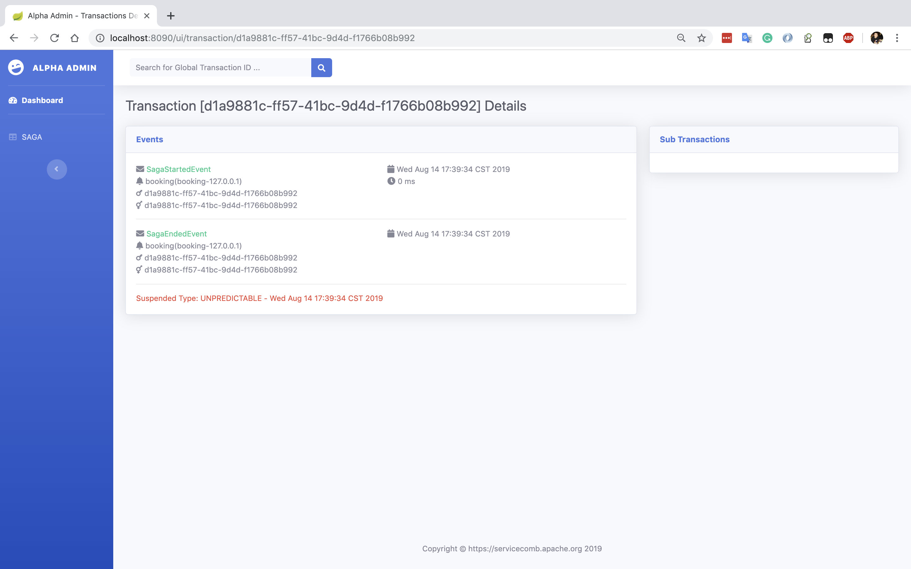
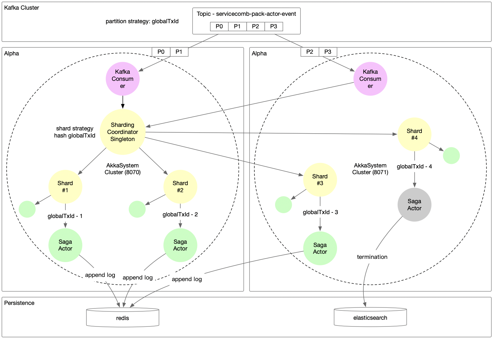

# 状态机模式

ServiceComb Pack 0.5.0 版本开始我们尝试使用状态机模型解决分布式事务中复杂的事件和状态关系，我们将 Alpha 看作一个可以记录每个全局事务不同状态的的盒子，Alpha 收到 Omega 发送的事务消息（全局事务启动、全局事务停止，全局事务失败，子事务启动，子事务停止，子事务失败等等）后完成一些动作（等待、补偿、超时）和状态切换。

分布式事务的事件使我们面临很复杂的情况，我们希望可以通过一种DSL来清晰的定义状态机，并且能够解决状态机本身的持久化和分布式问题，再经过尝试后我们觉得 [Akka](https://github.com/akka/akka) 是一个不错的选择。下面请跟我一起体验一下这个新功能。

## 重大更新

* 使用 Akka 状态机代替基于表扫描的状态判断
* 性能提升一个数量级，事件吞吐量每秒1.8w+，全局事务处理量每秒1.2k+
* 内置健康指标采集器，可清晰了解系统瓶颈
* 支持分布式集群
* 向前兼容原有 gRPC 协议
* 全新的可视化监控界面
* 开放全新的 API

## 快速开始

ServiceComb Pack 0.5.0 开始支持 Saga 状态机模式，你只需要在启动 Alpha 时增加 `alpha.spec.names=saga-akka` 参数 和 Omega 端程序时增加 `omega.spce.names=saga` 参数。你可以在 [docker hub](https://hub.docker.com/r/coolbeevip/servicecomb-pack) 找到一个 docker-compose 文件，也可以按照以下方式部署。

**注意：** 启用状态机模式后，Saga事务会工作在状态机模式，TCC依然采用数据库方式
**注意：** 0.6.0+ 版本 Omega 端程序不需要配置 `alpha.feature.akka.enabled=true` 参数

* 启动 PostgresSQL

  ```bash
  docker run -d -e "POSTGRES_DB=saga" -e "POSTGRES_USER=saga" -e "POSTGRES_PASSWORD=password" -p 5432:5432 postgres
  ```

* 启动 Elasticsearch

  ```bash
  docker run -d --name elasticsearch -p 9200:9200 -p 9300:9300 -e "discovery.type=single-node" elasticsearch:7.17.1
  ```

* 启动 Alpha

  ```bash
  java -jar alpha-server-${version}-exec.jar \
    --spring.datasource.url=jdbc:postgresql://0.0.0.0:5432/saga?useSSL=false \
    --spring.datasource.username=saga \
    --spring.datasource.password=password \
    --alpha.spec.names=saga-akka \
    --alpha.spec.saga.akka.channel.name=memory \
    --alpha.spec.saga.akka.repository.name=elasticsearch \
    --alpha.spec.saga.akka.repository.elasticsearch.uris=http://127.0.0.1:9200 \
    --spring.profiles.active=prd  
  ```

* Alpha WEB 管理界面

  浏览器中打开 http://localhost:8090/admin


### WEB 管理界面

状态机模式开启后，我们还提供了一个简单的管理界面，你可以在这个界面上看到 Alpha 的性能指标、全局事务统计和事务明细

#### 仪表盘



* Dashboard 仪表盘上方显示已经结束的全局事务数量

  TOTAL：总事务数

  SUCCESSFUL：成功结束事务数

  COMPENSATED：成功补偿结束事务数

  FAILED：失败（挂起）事务数

* Active Transactions 活动事务计数器

  COMMITTED：从启动到现在累计成功结束的事务数

  COMPENSATED：从启动到现在累计补偿的事务数

  SUSPENDED：从启动到现在累计挂起的事务数

* Active Transactions 组件计数器

  Events、Actors、Sagas、DB是一组计数器，分别显示Alpha系统中每个处理组件的处理前、处理后计数器以及平均处理事件，通过跟踪这些指标可以了解系统当前的性能以及瓶颈

  Events：显示 Alpha 收到的事件数量、受理的事件数量、拒绝的事件数量、平均每个事件的处理时间

  Actors：显示状态机收到的事件数量、受理的事件数量、拒绝的事件数量、平均每个事件的处理时间

  Sagas：显示开始的全局事务数量、结束的全局事务数量、平均每个全局事务的处理时间

  DB：显示持久化ES组件收到的已结束全局事务数量、持久化到ES中的全局事务数量

* Top 10 Slow Transactions

  显示最慢的前十个事务，点击后可以看到这个慢事务的明细信息

* System Info

  显示了当前 Alpha 服务的系统，JVM，线程等信息

**注意：**Active Transactions 中的指标值重启后自动归零

#### Saga 事务查询列表



事务查询列表可以显示所有已经结束的全局事务的服务ID，服务实例ID，全局事务ID，包含子事务数量、事务耗时、最终结束状态（成功提交、成功补偿、挂起）等，点击一个全局事务后可以查看这个全局事务的明细信息，你也可以在顶部搜索框中输入全局事务ID后快速定位到这个事务。

#### 全局事务明细

全局事务明细页面显示了这个全局事务的事件信息和子事务信息

Events 面板：本事务收到的事件类型、事件时间、发送事件的服务ID和实例ID等详细信息

Sub Transactions 面板：本事务包含的子事务ID，子事务状态，子事务耗时等详细信息

##### 全局事务成功结束



事件卡片右下角的下箭头点击后可以看到子事务的补偿方法信息

##### 全局事务成功补偿结束



红色字体显示收到了一个失败事件，点击右侧红色下箭头可以看到失败的错误堆栈

##### 全局事务失败结束-超时挂起



红色字体显示这个事务由于设置了5秒钟超时，并且在5秒钟后没有收到结束事件而处于挂起状态

##### 全局事务失败结束-非预期事件挂起



因为并没有收到子事务的任何事件，这并不符合状态机预期，所以红色字体显示不可预期挂起

## 集群

> 需要下载主干代码后自己编译 0.6.0 版本

依赖 Kafka 和 Redis 我们可以部署一个具有分布式处理能力的 Alpha 集群。Alpha 集群基于 Akka Cluster Sharding 和 Akka Persistence 实现动态计算和故障自愈。



上边是 Alpha 集群的工作架构图，表示部署了两个 Alpha 节点，分别是 8070 和 8071（这两编号是 [Gossip](https://en.wikipedia.org/wiki/Gossip_protocol) 协议的通信端口）。Omega 消息被发送到 Kafka ，并使用 globalTxId 作为分区策略，这保证了同一个全局事务下的子事务可以被有序的消费。KafkaConsumer 负责从 Kafka 中读取事件并发送给集群分片器 ShardingCoordinator，ShardingCoordinator 负责在 Alpha 集群中创建 SagaActor 并发送这个消息。运行中的 SagaActor 接收到消息后会持久化到 Redis 中，当这个集群中的节点奔溃后可以在集群其他节点恢复 SagaActor 以及它的状态。当 SagaActor 结束后就会将这一笔全局事务的数据存储到 ES。

启动 Alpha 集群非常容易，首先启动集群需要用到的中间件 Kafka Redis PostgreSQL/MySQL ElasticSearch，你使用 Docker 启动他们（在生产环境建议使用一个更可靠的部署方式），下边提供了一个 docker compose 文件 servicecomb-pack-middleware.yml，你可以直接使用命令 `docker-compose -f servicecomb-pack-middleware.yml up -d` 启动它。

```yaml
version: '3.2'
services:
  postgres:
    image: postgres:9.6
    hostname: postgres
    container_name: postgres
    ports:
      - '5432:5432'
    environment:
      - POSTGRES_DB=saga
      - POSTGRES_USER=saga
      - POSTGRES_PASSWORD=password

  elasticsearch:
    image: elasticsearch:7.17.1
    hostname: elasticsearch
    container_name: elasticsearch
    environment:
      - "ES_JAVA_OPTS=-Xmx256m -Xms256m"
      - "discovery.type=single-node"
      - "cluster.routing.allocation.disk.threshold_enabled=false"
    ulimits:
      memlock:
        soft: -1
        hard: -1
    ports:
      - 9200:9200
      - 9300:9300

  zookeeper:
    image: coolbeevip/alpine-zookeeper:3.4.14
    hostname: zookeeper
    container_name: zookeeper    
    ports:
      - 2181:2181

  kafka:
    image: coolbeevip/alpine-kafka:2.2.1-2.12
    hostname: kafka
    container_name: kafka    
    environment:
      KAFKA_ADVERTISED_HOST_NAME: 10.50.8.3
      KAFKA_ZOOKEEPER_CONNECT: zookeeper:2181
    ports:
      - 9092:9092
    links:
      - zookeeper:zookeeper
    depends_on:
      - zookeeper   

  redis:
    image: redis:5.0.5-alpine
    hostname: redis
    container_name: redis
    ports:
      - 6379:6379   
```

**注意：** KAFKA_ADVERTISED_HOST_NAME 一定要配置成服务器的真实 IP 地址，不能配置成 127.0.0.1 或者 localhost

然后我们启动一个具有两个 Alpha 节点的集群，因为我是在一台机器上启动两个节点，所以他们必须具备不同的端口

* 端口规划

  | 节点    | gRPC 端口 | REST 端口 | Gossip 端口 |
    | ------- | --------- | --------- | ----------- |
  | Alpha 1 | 8080      | 8090      | 8070        |
  | Alpha 2 | 8081      | 8091      | 8071        |

* 集群参数

  | 参数名                                           | 说明                                                         |
    | ------------------------------------------------ | ------------------------------------------------------------ |
  | server.port                                      | REST 端口，默认值 8090                                       |
  | alpha.server.port                                | gRPC 端口，默认值 8080                                       |
  | akkaConfig.akka.remote.artery.canonical.port     | Gossip 端口，默认值 8070                                     |
  | spring.kafka.bootstrap-server                    | Kafka 地址                                                   |
  | akkaConfig.akka-persistence-redis.redis.host     | Redis Host IP                                                |
  | akkaConfig.akka-persistence-redis.redis.port     | Redis Port                                                   |
  | akkaConfig.akka-persistence-redis.redis.database | Redis Database                                               |
  | akkaConfig.akka.cluster.seed-nodes[N]            | Gossip seed 节点地址，如果有多个 seed 节点，那么就写多行这个参数，每行的序号 N 从 0 开始采用递增方式 |
  | spring.profiles.active                           | 必须填写 prd,cluster                                         |

* 启动 Alpha 1

  ```bash
  java -jar alpha-server-0.7.0-SNAPSHOT-exec.jar \
    --server.port=8090 \
    --server.host=127.0.0.1 \
    --alpha.server.port=8080 \
    --alpha.spec.names=saga-akka \
    --alpha.spec.saga.akka.repository.name=elasticsearch \
    --alpha.spec.saga.akka.repository.elasticsearch.uris=http://127.0.0.1:9200 \
    --alpha.spec.saga.akka.channel.name=kafka \
    --alpha.spec.saga.akka.channel.kafka.bootstrap-servers=127.0.0.1:9092 \
    --akkaConfig.akka.remote.artery.canonical.port=8070 \
    --akkaConfig.akka.cluster.seed-nodes[0]="akka://alpha-cluster@127.0.0.1:8070" \
    --akkaConfig.akka-persistence-redis.redis.host=127.0.0.1 \
    --akkaConfig.akka-persistence-redis.redis.port=6379 \
    --spring.profiles.active=prd,cluster
  ```

* 启动 Alpha 2

  ```bash
  java -jar alpha-server-0.7.0-SNAPSHOT-exec.jar \
    --server.port=8091 \
    --server.host=127.0.0.1 \
    --alpha.server.port=8081 \
    --alpha.spec.names=saga-akka \
    --alpha.spec.saga.akka.repository.name=elasticsearch \
    --alpha.spec.saga.akka.repository.elasticsearch.uris=http://127.0.0.1:9200 \
    --alpha.spec.saga.akka.channel.name=kafka \
    --alpha.spec.saga.akka.channel.kafka.bootstrap-servers=127.0.0.1:9092 \
    --akkaConfig.akka.remote.artery.canonical.port=8071 \
    --akkaConfig.akka.cluster.seed-nodes[0]="akka://alpha-cluster@127.0.0.1:8070" \
    --akkaConfig.akka-persistence-redis.redis.host=127.0.0.1 \
    --akkaConfig.akka-persistence-redis.redis.port=6379 \
    --spring.profiles.active=prd,cluster
  ```

## 动态扩容

* Alpha 支持通过动态增加节点的的方式实现在线处理能力扩容
* Alpha 默认创建的 Kafka Topic 分区数量是 6，也就是说 Alpha 集群节点大于6个时将不能再提升处理性能，你可以根据规划在初次启动的时候使用  `kafka.numPartitions` 参数修改自动创建的 Topic 分区数

## 附件

[事件通道](eventchannel_zh.md)

[事务数据持久化](persistence_zh.md)

[Akka 配置](akka_zh.md)

[APIs](apis_zh.md)

[设计文档](design_fsm_zh.md)

[基准测试报告](benchmark_zh.md)


