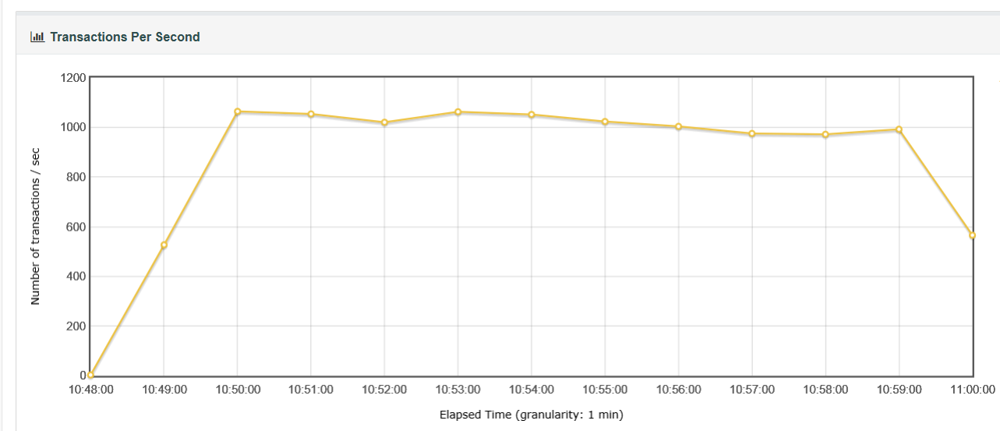
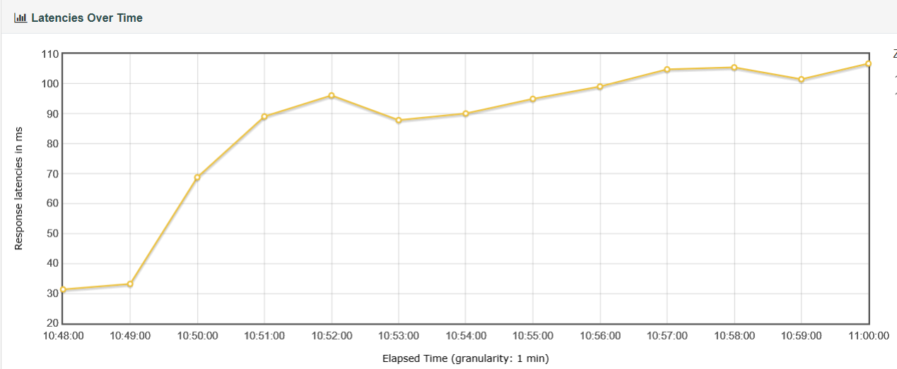

# Saga Performance Test

Performance test is automated with [JMeter](http://jmeter.apache.org/download_jmeter.cgi). A great tutorial can be found
at [Guru99](https://www.guru99.com/jmeter-performance-testing.html) if you are not familiar with JMeter.

## How to Run Performance Test
To run performance test, execute the following JMeter command
```
jmeter -n -t saga.jmx -l log.jtl
```

To generate test report from JMeter test log, run the following JMeter command
```
jmeter -g log.jtl -o <report folder>
```

## Test Report
Test machine: 16-core 64gb ubuntu 16.04 LTS

Test environment setup on this machine:
* saga
* car service in saga-demo
* MySQL

Test was run for 700 seconds with 200 concurrent users sending requests at delay of 100 milliseconds.




## Summary
Saga is very IO intensive, because it persists to database twice for each transaction. The total number of disk writing 
is 2 * Transactions + 2 (one for saga started event and the other for saga ended event).

Integration with a faster database will greatly improve saga performance.
