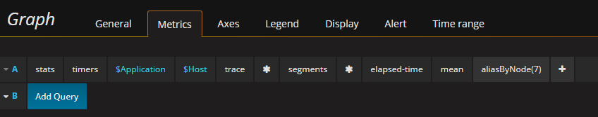

# Saga Performance Test

Performance test is automated with [JMeter](http://jmeter.apache.org/download_jmeter.cgi). A great tutorial can be found
at [Guru99](https://www.guru99.com/jmeter-performance-testing.html) if you are not familiar with JMeter.

## How to Run Performance Test
To run performance test, execute the following JMeter command
```
jmeter -n -t saga.jmx -l log.jtl
```

To generate test report from JMeter test log, run the following JMeter command
```
jmeter -g log.jtl -o <report folder>
```

## How to Enable Kamon Metrics
[Kamon](http://kamon.io/documentation/get-started/) is used to track saga performance and reports trace data to both log
and [StatsD](https://github.com/etsy/statsd/). The easiest way to visualize tracing reports is to use a [docker image](http://kamon.io/documentation/kamon-statsd/0.6.6/overview/)
composed with StatsD, [Graphite](http://graphite.wikidot.com/), and [Grafana](http://grafana.org/)

1. Build saga with profile `perf`.
```
mvn package -Pperf
```

2. Run saga with aspectj and Kamon enabled. 
By default, tracing data will be reported to StatsD running on `localhost` and port `8125`. To change the default StatsD
host configuration, pass `-Dkamon.statsd.hostname=<hostname>` and `-Dkamon.statsd.port=<port>` as vm options when running
saga.
```
java -javaagent:/path/to/aspectj-weaver.jar -Dkamon.modules.kamon-annotation.auto-start=yes -Dkamon.modules.kamon-log-reporter.auto-start=yes -Dkamon.modules.kamon-statsd.auto-start=yes -jar saga.jar
```

3. Add a new row with the following query in Grafana to display the segments of trace data. Please refer to [Grafana Tutorial](http://docs.grafana.org/guides/getting_started/)
if you need some help



## Recommended Test Setup
Three test machines to run the following services on each:
* saga
* car service in saga-demo
* MySQL

The car service and saga can share the same machine, since car service consumes very little CPU and memory, and has no disk
access.
